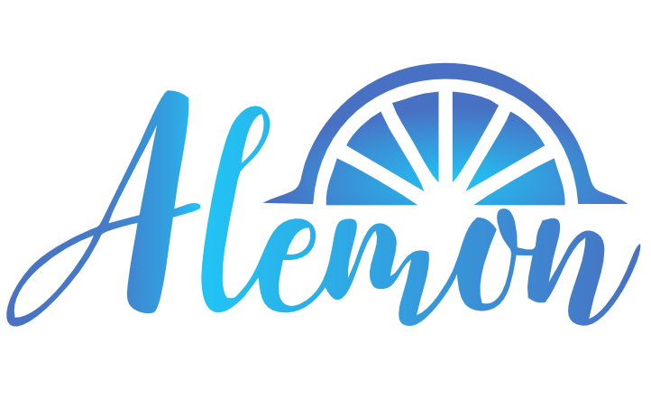

# [https://alemonjs.com/](https://alemonjs.com/)

跨平台开发的事件驱动机器人

## 生态列表

| Project                  | Status                              | Description    |
| ------------------------ | ----------------------------------- | -------------- |
| [alemonjs]               | [![alemonjs-s]][alemonjs-p]         | 标准应用解析器 |
| [jsxp]                   | [![jsxp-s]][jsxp-p]                 | 渲染器         |
| [chat-space]             | [![chat-space-s]][chat-space-p]     | SDK            |
| [react-puppeteer]        | [![tsxp-s]][tsxp-p]                 | 渲染器         |
| [create-alemonjs]        | [![c-s]][c-p]                       | 脚手架         |
| [@alemonjs/kook]         | [![kook-s]][kook-p]                 | KOOK 连接      |
| [@alemonjs/discord]      | [![discord-s]][discord-p]           | DC 公会连接    |
| [@alemonjs/qq-group-bot] | [![qq-group-bot-s]][qq-group-bot-p] | QQ 群连接      |
| [@alemonjs/qq-guild-bot] | [![qq-guild-bot-s]][qq-guild-bot-p] | QQ 频道连接    |
| [@alemonjs/qq]           | [![qq-s]][qq-p]                     | QQ 连接        |
| [@alemonjs/telegram]     | [![telegram-s]][telegram-p]         | telegram 连接  |

[alemonjs]: https://github.com/lemonade-lab/alemonjs/tree/main/packages/alemonjs
[alemonjs-s]: https://img.shields.io/npm/v/alemonjs.svg
[alemonjs-p]: https://www.npmjs.com/package/alemonjs
[jsxp]: https://github.com/lemonade-lab/alemonjs/tree/main/packages/jsxp
[jsxp-s]: https://img.shields.io/npm/v/jsxp.svg
[jsxp-p]: https://www.npmjs.com/package/jsxp
[chat-space]: https://github.com/lemonade-lab/alemonjs/tree/main/packages/chat-space
[chat-space-s]: https://img.shields.io/npm/v/chat-space.svg
[chat-space-p]: https://www.npmjs.com/package/chat-space
[react-puppeteer]: https://github.com/lemonade-lab/alemonjs/tree/main/packages/tsxp
[tsxp-s]: https://img.shields.io/npm/v/react-puppeteer.svg
[tsxp-p]: https://www.npmjs.com/package/react-puppeteer
[create-alemonjs]: https://github.com/lemonade-lab/alemonjs/tree/main/packages/create-alemonjs
[c-s]: https://img.shields.io/npm/v/create-alemonjs.svg
[c-p]: https://www.npmjs.com/package/create-alemonjs
[@alemonjs/kook]: https://github.com/lemonade-lab/alemonjs/tree/main/packages/kook
[kook-s]: https://img.shields.io/npm/v/@alemonjs/kook.svg
[kook-p]: https://www.npmjs.com/package/@alemonjs/kook
[@alemonjs/discord]: https://github.com/lemonade-lab/alemonjs/tree/main/packages/discord
[discord-s]: https://img.shields.io/npm/v/@alemonjs/discord.svg
[discord-p]: https://www.npmjs.com/package/@alemonjs/discord
[@alemonjs/qq-group-bot]: https://github.com/lemonade-lab/alemonjs/tree/main/packages/qq-group-bot
[qq-group-bot-s]: https://img.shields.io/npm/v/@alemonjs/qq-group-bot.svg
[qq-group-bot-p]: https://www.npmjs.com/package/@alemonjs/qq-group-bot
[@alemonjs/qq-guild-bot]: https://github.com/lemonade-lab/alemonjs/tree/main/packages/qq-guild-bot
[qq-guild-bot-s]: https://img.shields.io/npm/v/@alemonjs/qq-guild-bot.svg
[qq-guild-bot-p]: https://www.npmjs.com/package/@alemonjs/qq-guild-bot
[@alemonjs/qq]: https://github.com/lemonade-lab/alemonjs/tree/main/packages/qq
[qq-s]: https://img.shields.io/npm/v/@alemonjs/qq.svg
[qq-p]: https://www.npmjs.com/package/@alemonjs/telegram
[@alemonjs/telegram]: https://github.com/lemonade-lab/alemonjs/tree/main/packages/telegram
[telegram-s]: https://img.shields.io/npm/v/@alemonjs/telegram.svg
[telegram-p]: https://www.npmjs.com/package/@alemonjs/telegram

## Community

QQ Group 806943302
